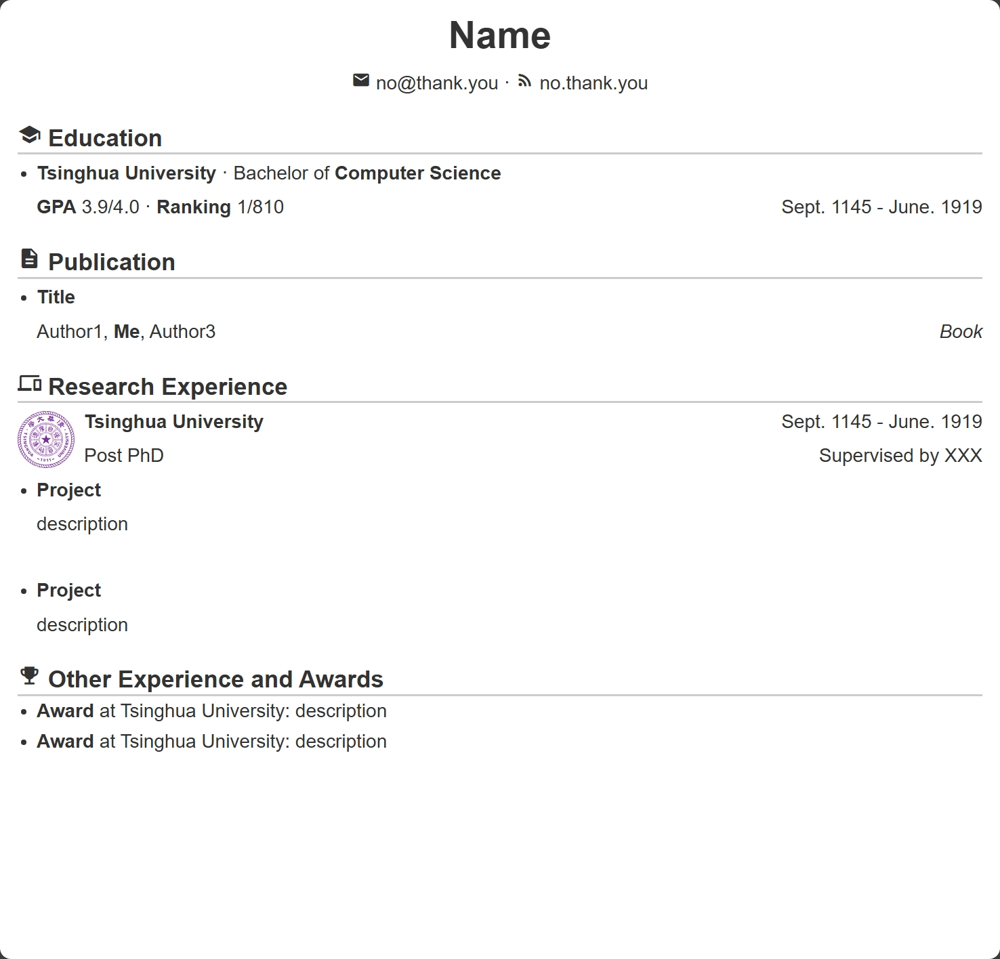
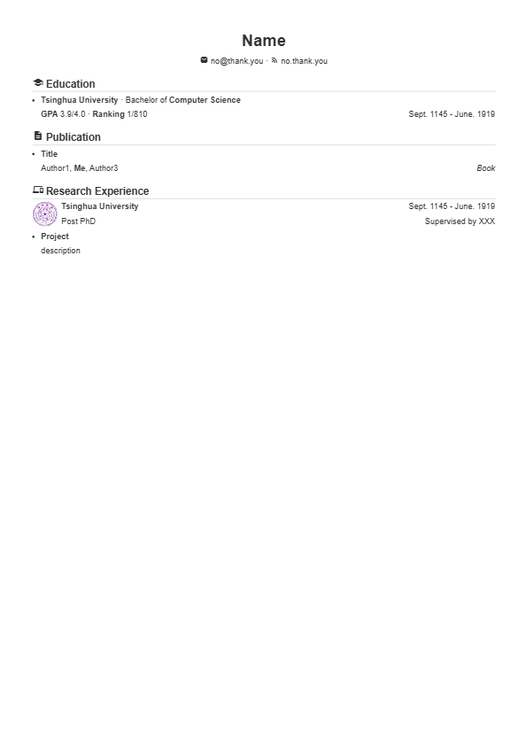

# Usage

- Edit [resume.md](./resume.md) using VSCode or any other markdown editors.
- Export resume.md as HTML.
- Open the exported HTML in browser like Edge and print it as PDF.

# Features

- `page-break` Tag: split page in PDF whlie nop in HTML mode.
- [Google Fonts](https://fonts.google.com/icons): embed fonts and icons.
- Custom Logo: Easy to add logos through `` tag

# Examples

Browser view:

PDF view (2 pages):

